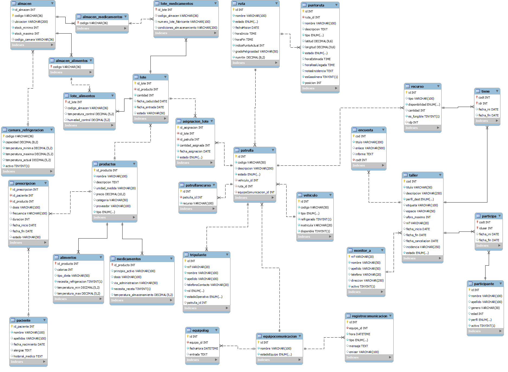
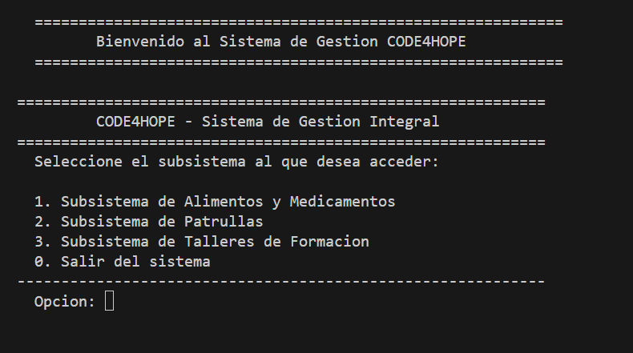
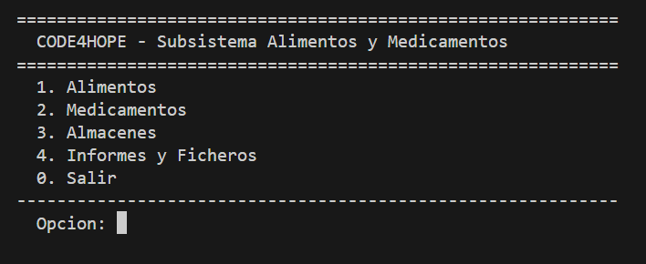
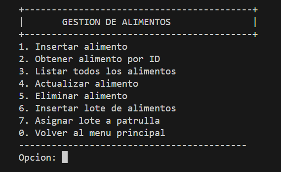
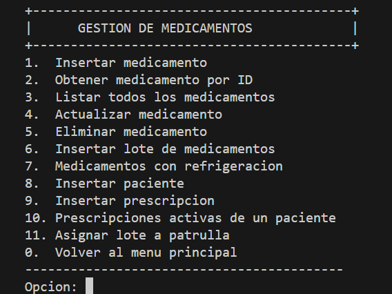
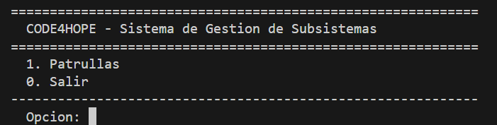
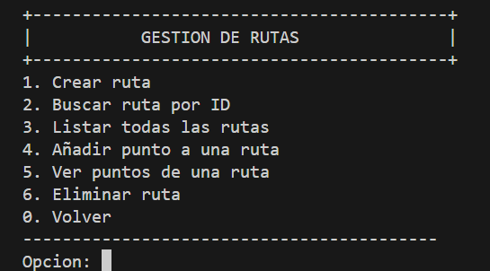
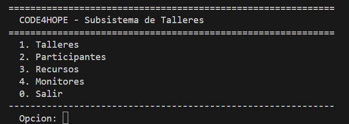
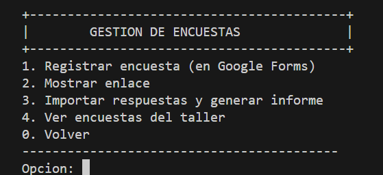

# 🌍 Code4Hope — Sistema de Gestión de Ayuda Humanitaria (SGAH)

Aplicación de escritorio en Java para gestionar patrullas humanitarias en zonas de conflicto: suministros, medicamentos, vehículos, rutas y talleres de formación, todo integrado en un sistema de consola con base de datos MySQL.

---

## Índice

- [Descripción](#descripción)
- [Integrantes](#integrantes)
- [Tecnologías utilizadas](#tecnologías-utilizadas)
- [Arquitectura del proyecto](#arquitectura-del-proyecto)
- [Módulos desarrollados](#módulos-desarrollados)
- [Ejemplos de código](#ejemplos-de-código)
- [Capturas del proyecto](#capturas-del-proyecto)
- [Conclusiones](#conclusiones)

---

## Descripción

**Code4Hope** nace de la necesidad de una organización internacional de ayuda humanitaria que opera en zonas de conflicto. El sistema permite planificar y gestionar las patrullas semanales encargadas de transportar alimentos y medicamentos, organizar talleres educativos y monitorizar el terreno en tiempo real.

El proyecto se ha desarrollado como **Proyecto Intermodular de 1º DAW** en el IES Font de Sant Lluís, bajo la tutela de Pascual Queralt, aplicando una arquitectura en 3 capas y metodologías ágiles con desarrollo iterativo por Sprints.

> [!NOTE]
> El sistema está diseñado para ejecutarse desde consola e interactúa con una base de datos MySQL local. Consulta el apartado de tecnologías para conocer los requisitos previos.

---

## Integrantes

- 👩‍💻 **Melisa Vafaeva** — Desarrolladora Software (Subsistema Talleres)
- 👨‍💻 **Jose Manuel Morato** — Desarrollador Software (Subsistema Patrullas)
- 👨‍💻 **Marc Nacher** — Desarrollador Software (Subsistema Alimentos y Medicamentos)
- 👨‍💻 **Julio Linares** — Desarrollador Software (Subsistema Alimentos y Medicamentos)

**Tutor del Proyecto:** Pascual Queralt
**Centro Educativo:** IES Font de Sant Lluís

---

## Tecnologías utilizadas

| Tecnología | Versión | Uso |
|---|---|---|
| ☕ Java | JDK 11+ | Lógica de negocio y controladores |
| 🗄️ MySQL | 8.0 | Base de datos relacional |
| 🔌 JDBC | mysql-connector 8.0.23 | Conexión Java ↔ MySQL |
| 🔧 Git | — | Control de versiones |
| 🐙 GitHub | — | Repositorio remoto y colaboración |
| 📄 HTML/CSS | HTML5 | Generación de informes exportados |

> [!IMPORTANT]
> Para ejecutar el proyecto es necesario tener MySQL corriendo en `localhost:3306` con usuario `root`, contraseña `root` y base de datos `code4hope`. Puedes crear la base de datos con el fichero `code4hope.sql` incluido en el repositorio.

---

## Arquitectura del proyecto

El sistema sigue una **arquitectura en 3 capas**:

```
Code4Hope/
├── src/
│   ├── main/                                  ← Capa de presentación (menú central)
│   ├── subsistema_alimentos_medicamentos/     ← Controlador del subsistema AlimMed
│   ├── subsistema_patrullas/                  ← Controlador del subsistema Patrullas
│   ├── subsistema_taller/                     ← Controlador del subsistema Talleres
│   ├── Entidad/                               ← Capa de modelo (~30 clases POJO)
│   └── DAO/                                   ← Capa de acceso a datos (~22 clases DAO)
├── database/                                  ← Scripts SQL de la base de datos
├── img/                                       ← Capturas e imágenes del proyecto
├── doc/                                       ← JavaDoc generado
├── lib/                                       ← Librerías externas (mysql-connector)
└── README.md
```

> [!TIP]
> Cada subsistema es independiente y se comunica con la base de datos a través de su propio conjunto de DAOs. La clase `Conexion_DB` centraliza la apertura y cierre de conexiones JDBC.

---

## Módulos desarrollados

### 1. 🚔 Subsistema de Patrullas

Gestión completa del personal, vehículos y operaciones de campo:

#### Gestión de Patrullas
Creación, búsqueda y actualización de estado (Planificada / En curso / Hecha / Cancelada). Permite asignar vehículo, ruta, equipo de comunicación, tripulantes y recursos a cada patrulla.

#### Gestión de Tripulantes
Registro de personal civil o uniformado con roles definidos. CRUD completo y liberación de asignaciones.

#### Gestión de Vehículos
Control de flota con tipos diferenciados (blindados, refrigerados, etc.). Consulta de disponibilidad en tiempo real.

#### Gestión de Rutas
Planificación de trayectos con puntos intermedios (`PuntoRuta`). Control de estados y cálculo de repostaje.

#### Equipos de Comunicación
Registro de equipos, log de actividad y registro de comunicaciones con tipo de mensaje.

#### Ficheros del subsistema
- Informe HTML de misión
- Exportación e importación de comunicaciones en CSV

---

### 2. 🍞 Subsistema de Alimentos y Medicamentos

#### Gestión de Alimentos
CRUD de alimentos con control de tipo, lote, fecha de caducidad y temperatura requerida. Asignación de lotes a patrullas para trazabilidad completa donante → beneficiario.

#### Gestión de Medicamentos
Control de stock sanitario con principio activo, condiciones de conservación y requisito de receta. Gestión de pacientes y prescripciones médicas vinculadas a entregas.

#### Gestión de Almacenes
Registro de almacenes de alimentos y almacenes de medicamentos, con cámaras de refrigeración asociadas.

#### Ficheros del subsistema
- Exportación e importación de alimentos/medicamentos en CSV
- Informes HTML de lotes de alimentos y medicamentos

---

### 3. 🎓 Subsistema de Talleres de Formación

#### Gestión de Talleres
Creación y planificación de talleres (alfabetización, apoyo psicosocial, etc.) con control de aforo, estado y asignación de monitores. Exportación a informe HTML.

#### Gestión de Participantes
Registro de colectivos vulnerables con alta, modificación y baja del sistema.

#### Gestión de Monitores
CRUD de monitores responsables de cada taller.

#### Gestión de Recursos
Control de materiales didácticos con asignación a patrullas y talleres, liberación y cambio de estado.

#### Encuestas de Impacto
Integración con Google Forms para registrar encuestas, mostrar enlace, importar respuestas y generar informe de impacto social.

---

## Ejemplos de código

### 💻 Menú principal del sistema

```java
public static void main(String[] args) {
    Scanner sc = new Scanner(System.in);
    boolean salir = false;

    while (!salir) {
        mostrarMenuPrincipal();
        int opcion = Integer.parseInt(sc.nextLine().trim());

        switch (opcion) {
            case 1:
                ControladorSubsistemaAlimMed.iniciarSubsistemaAlimMed();
                break;
            case 2:
                ControladorSubsistemaPatrullas.iniciarSubsistemaPatrullas();
                break;
            case 3:
                ControladorSubsistema_Talleres.main(new String[0]);
                break;
            case 0:
                salir = true;
                break;
        }
    }
}
```

### 🔌 Conexión a la base de datos (JDBC)

```java
public Connection abrirConexion() throws Exception {
    Class.forName("com.mysql.cj.jdbc.Driver");
    Connection conexion = DriverManager.getConnection(
        "jdbc:mysql://localhost:3306/code4hope", "root", "root"
    );
    System.out.println("Conexion establecida con la BD");
    return conexion;
}
```

### 🗄️ Consulta SQL — Ejemplo del DDL

```sql
-- Tabla de patrullas
CREATE TABLE patrulla (
    id_patrulla   INT AUTO_INCREMENT PRIMARY KEY,
    nombre        VARCHAR(100) NOT NULL,
    estado        ENUM('PLANIFICADA','EN_CURSO','HECHA','CANCELADA') DEFAULT 'PLANIFICADA',
    fecha_inicio  DATE,
    fecha_fin     DATE
);

-- Tabla de tripulantes
CREATE TABLE tripulante (
    id_tripulante INT AUTO_INCREMENT PRIMARY KEY,
    nombre        VARCHAR(100) NOT NULL,
    rol           ENUM('CONDUCTOR','MEDICO','ESCOLTA','MONITOR') NOT NULL,
    estado        ENUM('DISPONIBLE','ASIGNADO','BAJA') DEFAULT 'DISPONIBLE'
);
```


---

## Capturas del proyecto

### Diagrama Entidad-Relación



### Menú principal del sistema



### Subsistema de Alimentos y Medicamentos



### Gestión de Alimentos



### Gestión de Medicamentos



### Subsistema de Patrullas



### Gestión de Rutas



### Subsistema de Talleres



### Encuestas de Impacto




---

## Conclusiones

El desarrollo de **Code4Hope** nos ha permitido aplicar de forma integrada y real los conocimientos adquiridos a lo largo del curso: programación orientada a objetos en Java, acceso a bases de datos relacionales con JDBC y MySQL, diseño de arquitecturas multicapa, gestión de ficheros CSV y generación de informes HTML, y trabajo colaborativo mediante Git y GitHub.

Más allá de lo técnico, el proyecto nos ha enseñado a organizarnos como equipo siguiendo metodologías ágiles, a dividir un sistema complejo en subsistemas independientes y a mantener un código limpio, documentado con JavaDoc y versionado de forma coherente.

> [!IMPORTANT]
> Este proyecto ha sido desarrollado con fines educativos en el marco del módulo intermodular de 1º DAW. Financiado por el Plan de Recuperación, Transformación y Resiliencia — NextGenerationEU.
